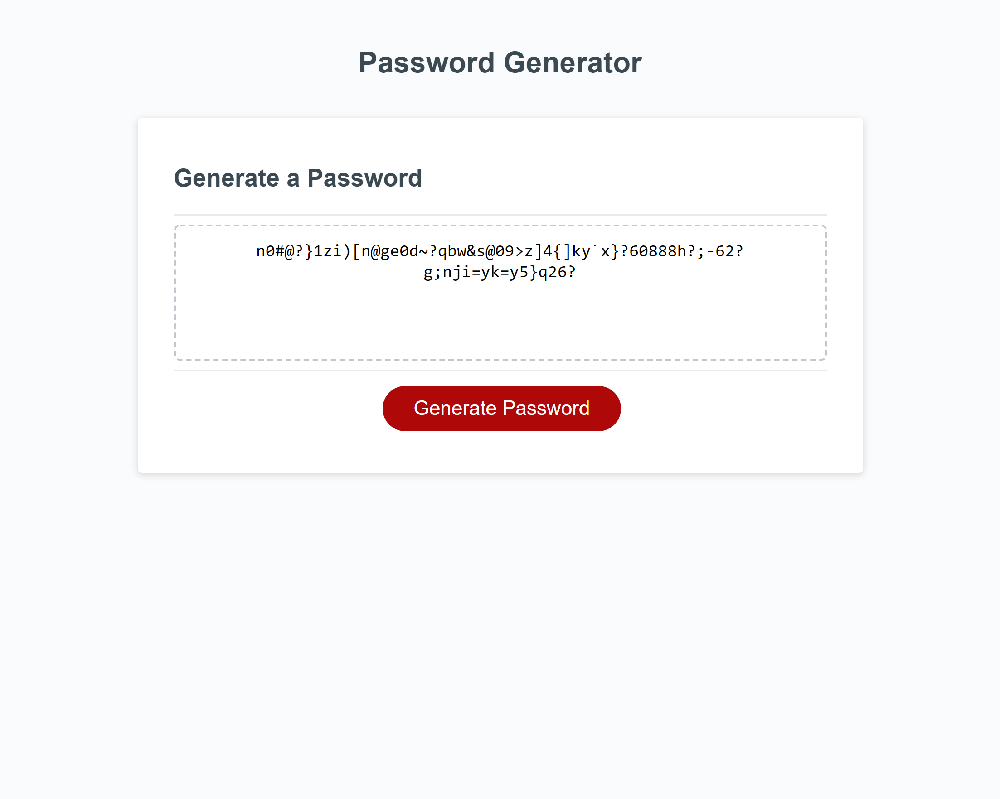

# 03-Javascript-Password-Generator

## Project Description

This week's project required me to build a functioning random password generator. The generator is required to have prompts that ask you for your desired password size as well as whether or not you wanted lower case letters, upper case letters, numbers and/or symbols included in the password. All of the HTML and CSS code was included in the assignment and I was required to do all of the javascript except for the bit at the bottom that creates the page's one button. The final result of my work is just one way that this task could be completed and in researching how to put everything together I came across some other interesting possibilities such as having the user click boxes to specify whether or not they wanted certain characters included in the password as opposed to using prompts. Another fun version had a slide bar to indicate how long you wanted the password to be.

## Link to application on Github:

https://github.com/micah41224/03-Javascript-Password-Generator

## Link to deployed application:

https://micah41224.github.io/03-Javascript-Password-Generator/

## Screenshot of final page:

